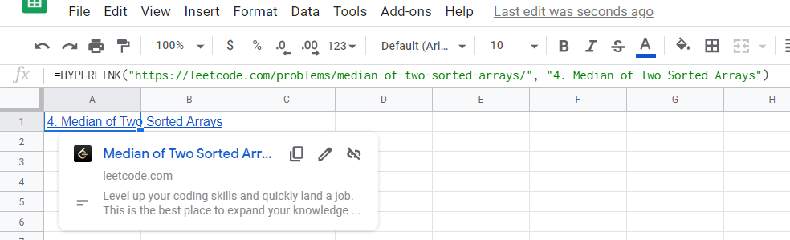

# LeetCode-HyperLink-Generator
A Chrome Extension for personal use

## Install the Extension
1. Download the repo folder
2. Chrome > More Tools > Extensions
3. Toggle Developer Mode
4. Load Unpacked Extension
5. Choose the downloaded repo folder

## Use Case Example
1. Once the extension is installed, go to any leetcode problem page like https://leetcode.com/problems/median-of-two-sorted-arrays/ using Chrome
2. Click the extension
3. You now have 
`=HYPERLINK("https://leetcode.com/problems/median-of-two-sorted-arrays/", "4. Median of Two Sorted Arrays")` copied to your clipboard
4. Go to Google Sheets and paste it directly in the desired cell. Now you are good to go!

## Reference
[Building a really simple page-scraping Chrome extension](https://www.tomforth.co.uk/chromeextension/) by Thomas Forth
